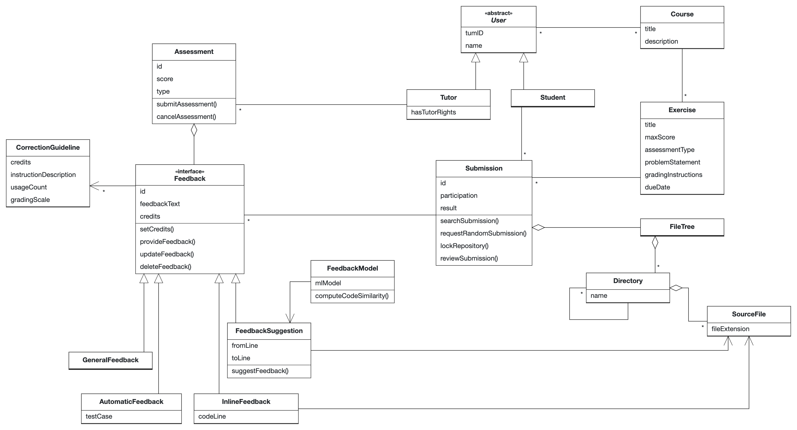

Analysis Object Model
===========================================

The Analysis Object Model describe the static structure of the system by means of classes, attributes and associations.

The **Course** class refers to different university courses that use the Artemis web application. Each course has a title and a description and has multiple exercises with each exercise class containing attributes for the problem statement, the grading instructions, the score, etc. A course can be taken or worked for by multiple users.

The **User** class refers to an Artemis user. This class is inherited by the **Student** class representing students that are enrolled in a course as well as by the **Tutor** class representing the tutors for the corresponding course. Each user may take part in multiple courses. A tutor has additional tutor rights in the respective course on Artemis.

Each student can work on multiple exercise and submit the respective solutions. After receiving feedback the student may review the tutor's feedback. This is modeled by the **Submission** class. A specific submission belongs to one exercise and each exercise can have multiple student submissions. A tutor who is using the Themis iPad App to provide feedback to the students can search for a student's submission or request a random one. When assessing a submission the respective repository is locked.

The structure of a submission is given as follows: A submission for programming exercises consists of a file tree that is modeled with by the **FileTree** class. This connection is modeled via aggregation. A file tree can consist of multiple directories, as modeled by the **Directory** class which, in return, can also contain multiple sub-directories. A directory contains multiple source files, which are represented by the **SourceFile** class.

The **Assessment** class represents the assessment a tutor does for a specific submission. The tutor can submit the assessment after providing feedback or cancel it. A tutor may have multiple assessments for multiple submissions.

The abstract **Feedback** class is the focus of this Analysis Object Model. It represents the feedback the tutor provides for each student submission. A feedback object has a feedback text and credits and can be updated or deleted afterwards. Themis supports multiple types of feedback, all inheriting from the abstract superclass. Each feedback belongs to one submission and each submission can contain multiple feedbacks.
**GeneralFeedback** refers to feedback that is, as the name implies, general and applies to the entire submission or file, whereas **InlineFeedback** is feedback that refers to a specific code line. The **AutomaticTestCaseFeedback** models the automatic test cases that are executed by Artemis. 
The **FeedbackSuggestions** class represents the feedback computed by the **FeedbackModel** class, which implements the *computeCodeSimilarity()* method to generate the feedback suggestions. **FeedbackModel** computes **FeedbackSuggestion** objects and does not have any information about the **FeedbackSuggestion** objects once they have been created.
Both the inline feedback and the feedback suggestions reference the specific source file the feedback refers to.
