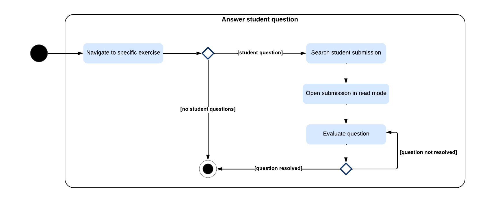
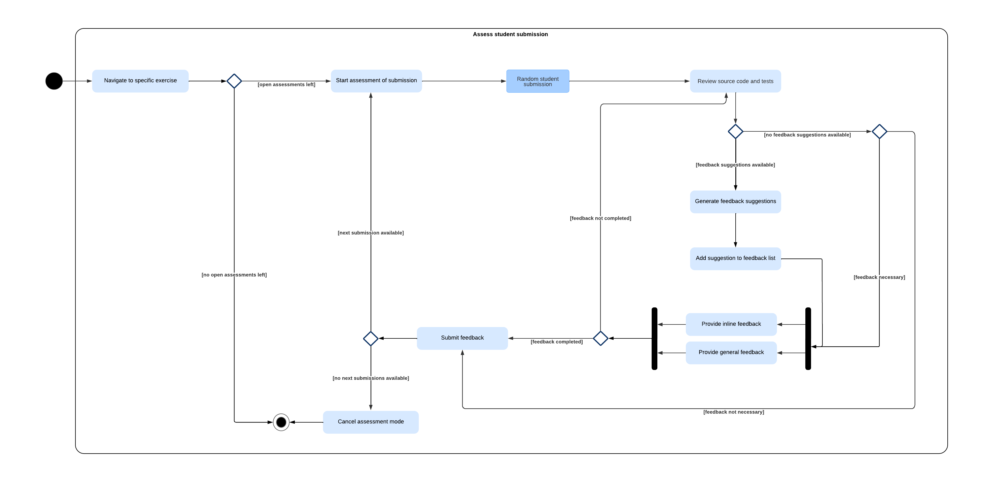
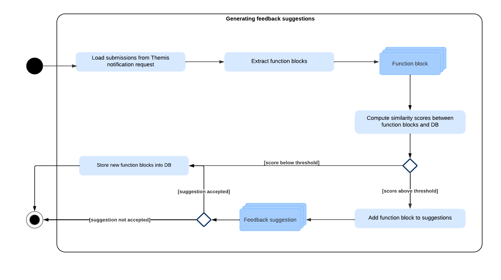

Dynamic Model
===========================================

This section focuses on the dynamic behavior of the system. UML activity diagrams are the most suitable way of representation for this purpose.

Since it is crucial to show the dynamic behavior of both *Themis* as well as for the *Themis machine learning component*, this section will be divided into two parts.

****
Themis app
****

Answering student questions
------------

This activity diagram shows how the flow of answering a student question on a certain exercise e.g. during the lecture looks like. Assume that the tutor already opened the app and navigated to the corresponding lecture course.
|
1. The tutor navigates to the specific exercise.
2. If there are no questions from any student, the tutor is done. Otherwise, the tutor searches for the student's submission.
3. Then, the tutor opens the submission in *read-mode*.
4. The tutor evaluates the question. If the question is not resolved, the tutor continues answering it.
5. If otherwise, the tutor is done.

Assessing student submissions
------------

This activity diagram shows the workflow of assessing student submissions in the app. Assume that the tutor already opened the app and navigated to the corresponding lecture course.
|
1. The tutor navigates to the specific exercise.
2. If there are no open assessments left, the tutor is done.
3. If otherwise, the tutor starts the assessment of submissions. The tutor receives a random student submission in return.
4. The tutor reviews the source code and the executed tests.
5. If there are feedback suggestions available, the suggestions are generated and the tutor adds them to the feedback list. Otherwise, the tutor checks if feedback is necessary.
6. Afterwards, the tutor can add inline and general feedback to the feedback list.
7. If the tutor is not yet done with providing feedback, they can review the source code and tests again, eventually for other files as well.
8. After providing all necessary feedback, the tutor can submit the feedback and thus continue the assessment process.
9. If there are no more open assessments left, the tutor cancels the assessment mode and is done.

****
ThemisML Server
****

Generating feedback suggestions
------------

This activity diagram shows the process of generating feedback suggestions.
|
1. First, the submissions are loaded from the Themis notification request.
2. Then, the function blocks of each submission are extracted. This results in a list of function blocks.
3. Afterwards the similarity scores between the extracted function blocks and the function blocks that are stored in the database are computed.
4. If the score of a function block is above a given threshold, the function block is added to the suggestions list. Otherwise, the new function block is stored in the database.
5. If the suggestion is accepted by the tutor, the corresponding function block is stored in the database. 

