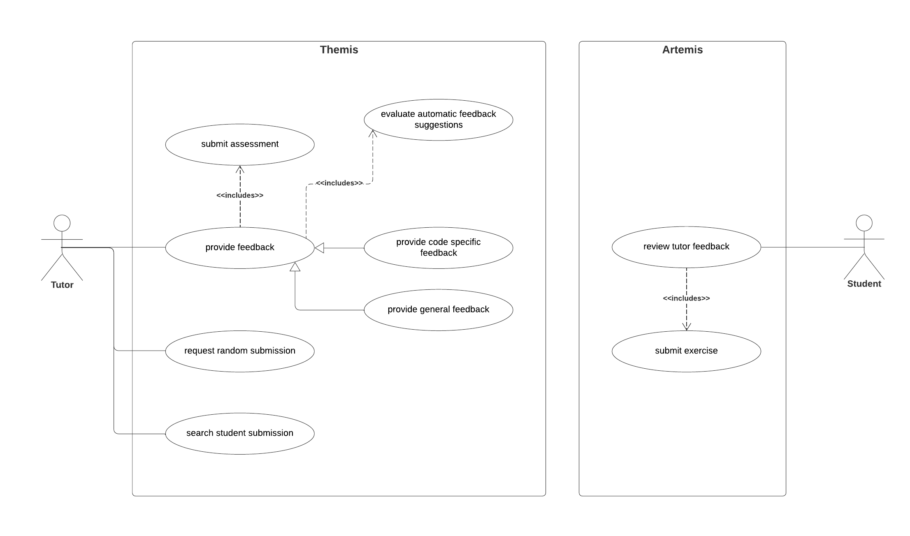

Use Case Model
===========================================

This section describes the functional behavior of the system as seen by the user. For this, UML use case diagrams are very suitable and show the interaction between the user and the system. In this setting, there are two systems and two different actors. 

|

Themis is the system the tutor interacts with. A tutors main use cases are searching for a student submission, requesting a random submission and providing feedback.
The *provide feedback* use case includes the *submit assessment* use case since it is not possible to provide the student with feedback without submitting the exercise previously.
As a tutor might provide the student with code specific or general feedback, the corresponding use cases inherit from the *provide feedback* use case.
Providing students with feedback also includes evaluating the automatic feedback suggestions.
