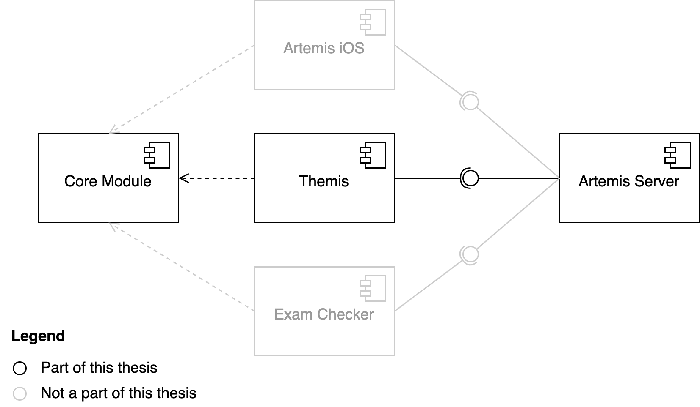
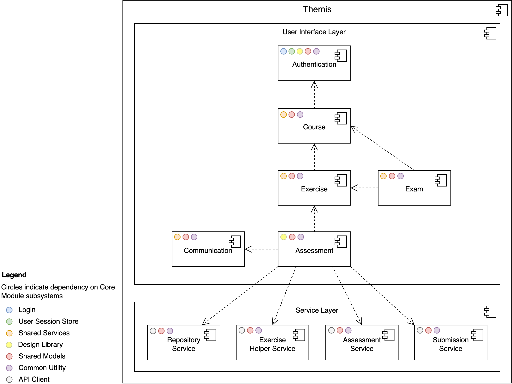
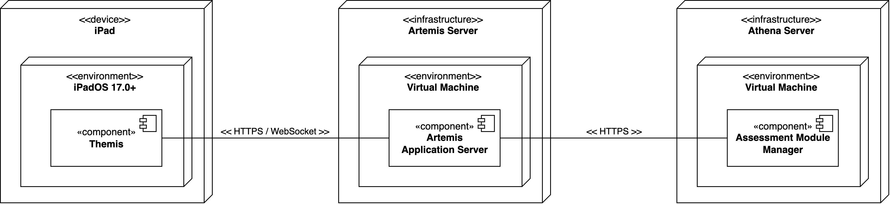

.. _system_design:

System Design
=============

.. contents:: Contents
    :local:
    :depth: 1

.. _high_level_design:

High-Level Design
----------------
The following diagram shows a high-level overview of three iOS clients, the Core Module containing shared components,
and the Artemis Server.

    High-Level Component Diagram

.. _server_architecture:

Themis Subsystem Decomposition
------------------------------

The following UML component diagram shows internal details of Themis and its dependencies on ArtemisCore components.
To ensure that the diagram remains comprehensible and uncluttered, we’ve excluded the view models.

    Subsystem Decomposition of Themis

The **Authentication** subsystem helps the user authenticate using the **Login** subsystem. Once a user successfully logs in,
the **Course** subsystem takes over, responsible for displaying courses where the user is as a tutor. Additionally, this
subsystem manages the retrieval and presentation of exercises and exams associated with these courses. When the system
needs to present more detail about a particular exam or an exercise, the **Exercise** and **Exam** subsystems come into play.
The **Exam** subsystem primarily focuses on presenting the exercises within an exam context and leverages the **Exercise**
subsystem when the user selects a particular exercise. When the user initiates an assessment on a submission, the
**Assessment** subsystem.

.. _deployment:

Deployment
----------

The following UML deployment diagram shows a typical deployment of Themis, Artemis application server and Athena server.
The Artemis server communicates with Athena to fetch feedback suggestions.

    Deployment Diagram

.. include:: data-management.rst
.. include:: access-control.rst
.. include:: global-software-control.rst

