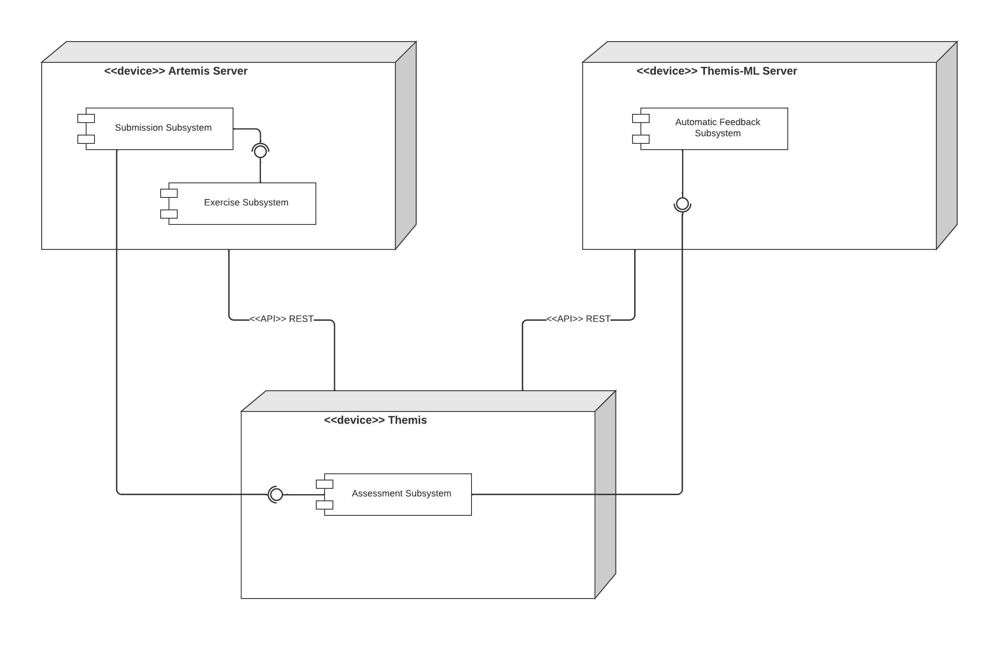

Hardware/Software Mapping
===========================================

The diagram below shows the hardware and software mapping of the system.
Themis is used by tutors on an iPad. Feedback suggestions are provided by the Assessment subsystem within the app which depends 
on the Submissions Subsystem of the Artemis Server and the Automatic Feedback Subsystem of the Themis-ML Server.
Communication between nodes are facilitated by REST API.
Please refer to `Artemis docs` and `Themis-ML` for more details regarding its deployment.

Artemis' Submissions Subsystem depends on an Exercise Subsystem within the server, 
which provides service for managing programming exercises and their configuration. 
This subsystem in turn requires Themis' Automatic Feedback Subsystem, 
which provides a tutor's feedback for a given submission. 

Themis' Assessment Subsystem also requires the Automatic Feedback Subsystem of the Themis-ML server in order to provide feedback suggestions to the tutor.

   *Deployment overview*

.. _Artemis docs: https://docs.artemis.cit.tum.de/dev/system-design/#deployment
.. _Themis-ML: https://ls1intum.github.io/Themis/admin/deployment/
