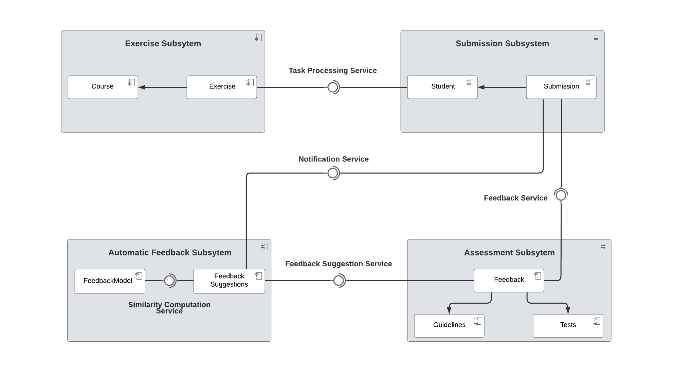

Subsystem Decomposition
===========================================

This section aims to describe the top-level view of the system in terms of components, subsystmes and the dependencies among components respectively subsystems.

The system can be divided into four major subsystems. 

The **Exercise Subsystem** is provided by Artemis and contains the Course and Exercise components. The dependency between an exercise and its' corresponding course is modeled as shown.
This subsystem provides the *Task Processing Service* to the **Submission Subsystem** that allows the access to an exercise in order to work on it.

The **Submission Subsystem** is also provided by Artemsi and contains the Student and Submission components with the Submission component depending on the Student.

The **Assessment Subsystem** contains the Feedback component that depends on the Guidelines and the Tests. It provides the *Feedback Service* to the **Submission Subsystem** and enables the addition of feedback to a submission.

The **Automatic Feedback Subsystem** represents the machine learning component of the system. Inside, it contains the FeedbackModel and the FeedbackSuggestions components. The FeedbackModel provides the *Similarity Computation Service* to the FeedbackSuggestions. The subsystem in return provides the *Notification Service* to the **Submission Subsystem** and the *Feedback Suggestions Service* to the **Assessment Subsystem**.
