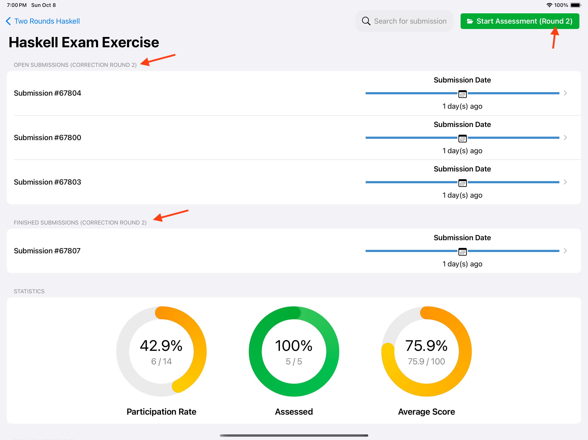
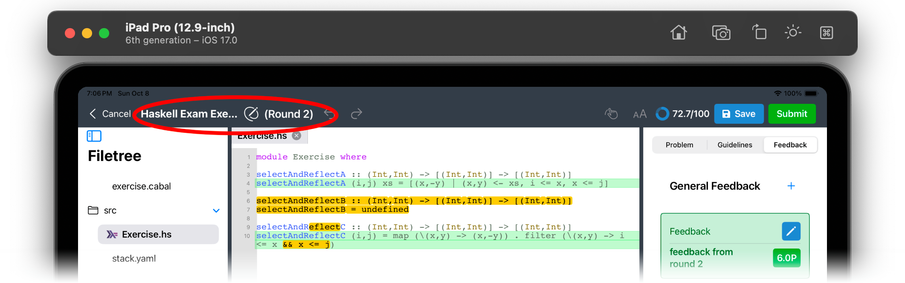

Assessment
==========

View Exercises
--------------
After login, you will be redirected to the course view, where you can select a course and 
view exercises. You can find more information about this view in the following video:

.. raw:: html

	<iframe src="https://live.rbg.tum.de/w/artemisintro/40508?video_only=1&t=0" allowfullscreen="1" frameborder="0" width="600" height="500">
		Course view tutorial
	</iframe>

By tapping on an exercise in the course view you can navigate to a new screen where exercise
details are shown. From here, you can start a new assessment, or manage ongoing assessments.

.. raw:: html

	<iframe src="https://live.rbg.tum.de/w/artemisintro/40568?video_only=1&t=0" allowfullscreen="1" frameborder="0" width="600" height="500">
		Exercise view tutorial
	</iframe>

Themis supports the assessment of the following exercise types:

.. toctree::
	
	/user/programming-assessment/programming-assessment
	/user/text-assessment/text-assessment
	/user/modeling-assessment/modeling-assessment
	/user/file-upload-assessment/file-upload-assessment

Assess Exam Exercises
---------------------

Themis supports the assessment of exam exercises as well. To assess an exam exercise, 
navigate to the relevant exam and select the exercise that you want to assess. 

If the second correction round is enabled and all submissions for the first round are assessed, 
the **Start Assessment** button changes into **Start Assessment (Round 2)**. In addition, 
the **Open Submissions (Correction Round 2)** and **Finished Submissions (Correction Round 2)** 
sections appear.

    Exercise View in Second Correction Round

When performing an assessment in the second round, the assessment view toolbar contains a **Round 2** 
label.

    Assessment View in Second Correction Round
