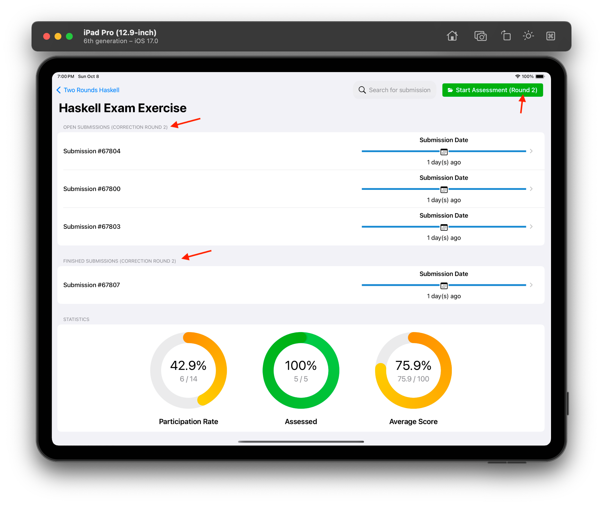

Assessment
==========

Assess Exercises
----------------
After login, you will be redirected to the course view, where you can select a course and 
view exercises. You can find more information about this view in the following video:

.. raw:: html

	<iframe src="https://live.rbg.tum.de/w/artemisintro/40508?video_only=1&t=0" allowfullscreen="1" frameborder="0" width="600" height="500">
		Course view tutorial
	</iframe>

By tapping on an exercise in the course view you can navigate to a new screen where exercise
details are shown. From here, you can start a new assessment, or manage ongoing assessments.

.. raw:: html

	<iframe src="https://live.rbg.tum.de/w/artemisintro/40568?video_only=1&t=0" allowfullscreen="1" frameborder="0" width="600" height="500">
		Exercise view tutorial
	</iframe>

Themis supports the assessment of the following exercise types:

.. toctree::
	
	/user/programming-assessment/programming-assessment
	/user/text-assessment/text-assessment
	/user/modeling-assessment/modeling-assessment
	/user/file-upload-assessment/file-upload-assessment

General Assessment Elements
---------------------------
The assessment view of Themis contains some elements that are common for all exercise types.

Toolbar
^^^^^^^

    Assessment View Toolbar

1. **Cancel Button** - allows you to cancel the assessment either by deleting or saving the current state
2. **Exercise Name Label** - indicates the name of the exercise that you are currently assessing
3. **Undo Button** - allows you to undo the last operation that you have done
4. **Redo Button** - allows you to redo the last operation that you have done
5. **Referenced Feedback Mode Button** - when enabled, allows you to add referenced (inline) feedback
6. **Font Size Button** - allows changing the font size
7. **Score Label** - shows the current score of the submission
8. **Save Button** - saves the current state of the assessment
9. **Submit Button** - submits the assessment

Correction Pane
^^^^^^^^^^^^^^^
The correction pane can be dragged from the right to view the problem statement,
correction guidelines, and an overview of feedback added to the submission. All
three states of the correction pane can be seen below:

.. figure:: ./images/correction-sidebar.png
	:width: 85%
	:align: center
	
	Correction Pane

General feedback can be added with the |plus-btn| button. This button reveals a 
sheet where you can type the feedback text, adjust the score, and select a grading 
criterion:

	
	Add Feedback Sheet

You can edit feedback by tapping on the |edit-btn| button on the correction pane.

In order to delete an existing feedback, swipe it to the left on the correction pane 
as shown below:

	
	Swipe-To-Delete Action

.. |edit-btn| image:: ./images/edit-btn.png
   :width: 25px
   
.. |plus-btn| image:: ./images/plus-btn.png
   :width: 25px

Assess Exam Exercises
---------------------

Themis supports the assessment of exam exercises as well. To assess an exam exercise, 
navigate to the relevant exam from the course view and select the exercise that you want 
to assess.

|pic1| → |pic2|

If the second correction round is enabled and all submissions for the first round are assessed, 
the **Start Assessment** button changes into **Start Assessment (Round 2)**. In addition, 
the **Open Submissions (Correction Round 2)** and **Finished Submissions (Correction Round 2)** 
sections appear.

    Exercise View in Second Correction Round

When performing an assessment in the second round, the assessment view toolbar contains a **Round 2** 
label.

.. figure:: ./images/2nd-round-assessment-view.png
    :align: center
    :alt: Assessment View in Second Correction Round
    :width: 85%

    Assessment View in Second Correction Round
