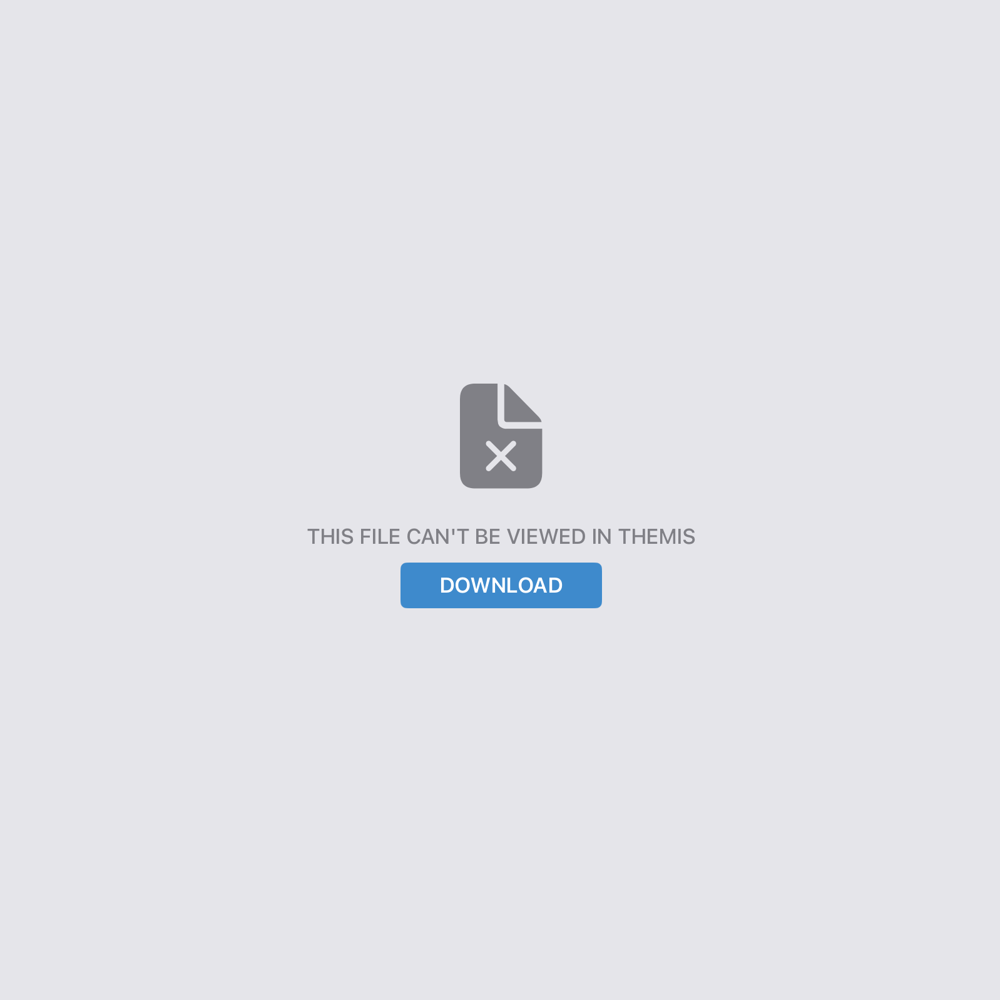
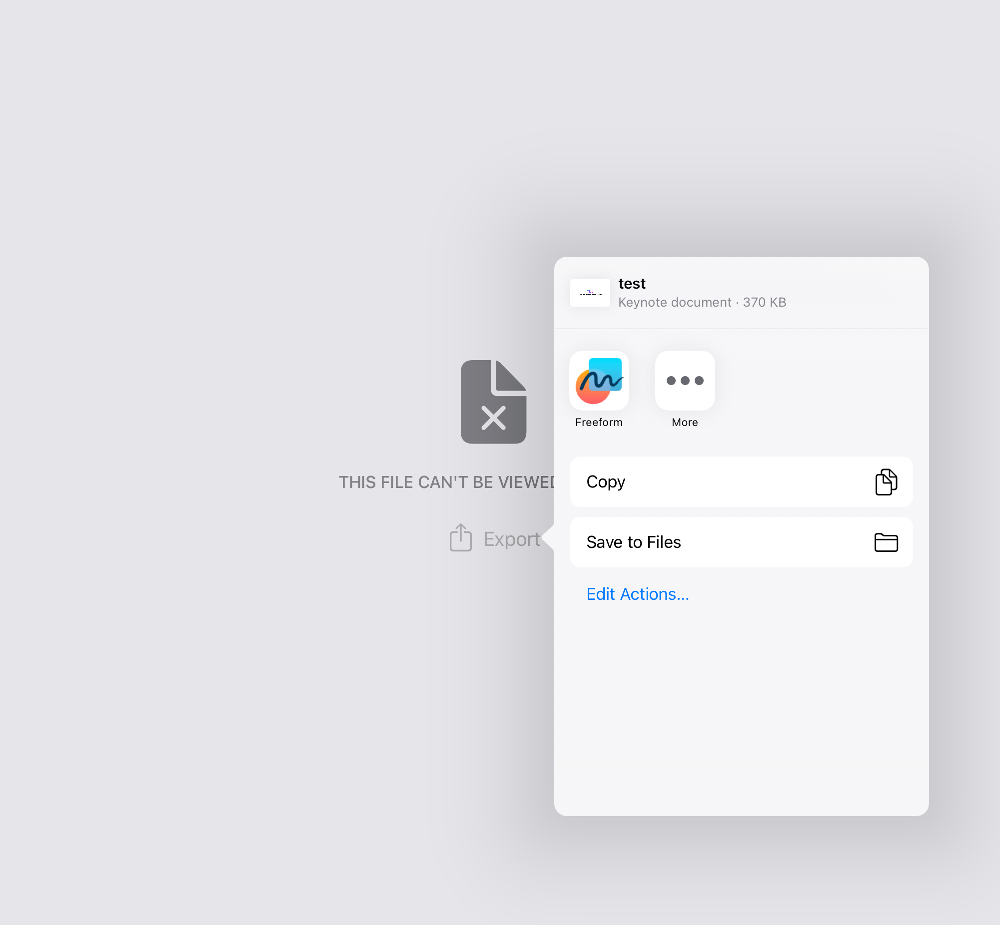

File Upload Exercise
====================
.. raw:: html

	<iframe src="https://live.rbg.tum.de/w/artemisintro/41039?video_only=1&t=0" allowfullscreen="1" frameborder="0" width="600" height="500">
		File upload exercise assessment tutorial
	</iframe>

File upload exercises do **not** support referenced feedback.

The following **file extensions** are supported by Themis and can be viewed without leaving 
the app:

- pdf
- jpeg
- png
- doc
- docx
- xlsx
- txt
- csv

If a submission contains an unsupported file, you can download the file and export it 
to another app to view:

	
	Unsupported File Upload Exercise Submission

	
	Exporting Unsupported File Upload Exercise Submission