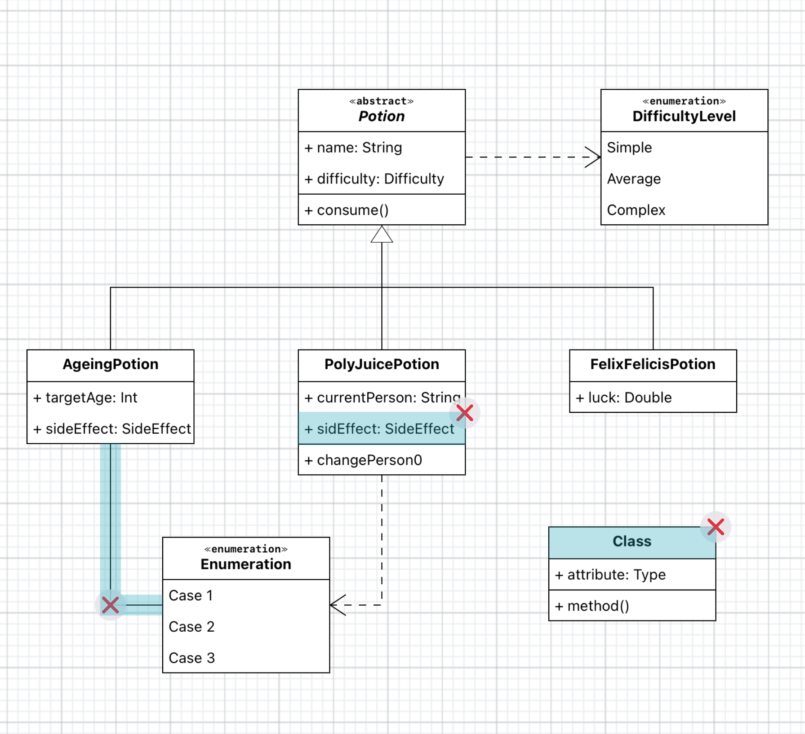

Modeling Exercise
=================
.. raw:: html

	<iframe src="https://live.rbg.tum.de/w/artemisintro/41038?video_only=1&t=0" allowfullscreen="1" frameborder="0" width="600" height="500">
		Modeling exercise assessment tutorial
	</iframe>
	
When the referenced feedback mode (|feedback-mode-btn|) is enabled, you can tap on 
the model elements to specify the part of the model you are referring to.

.. |feedback-mode-btn| image:: ../assessment-overview/images/feedback-mode-btn.png
   :width: 25px

Feedback Suggestions
--------------------
Themis shows feedback suggestions for modeling exercises when available. The suggestions are shown 
as light blue highlights on model elements. 

	
	Modeling Submission With Suggestions (blue)

You can tap on the highlighted elements to edit or reject suggestions. By default, all suggestions are 
automatically applied.
