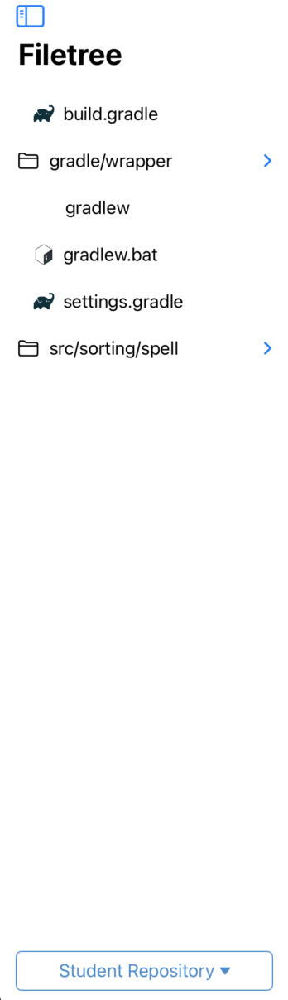
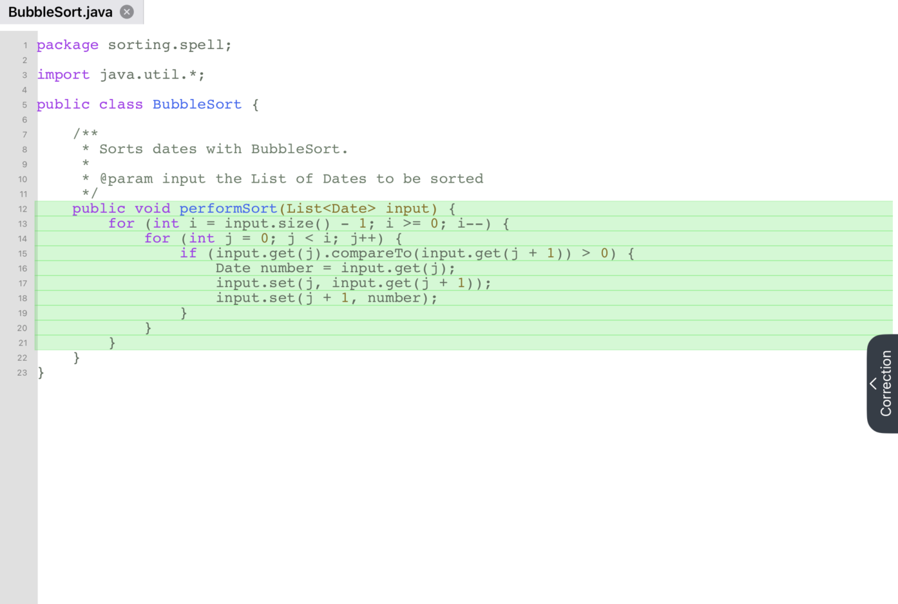

Programming Exercise
====================
.. raw:: html

	<iframe src="https://live.rbg.tum.de/w/artemisintro/40962?video_only=1&t=0" allowfullscreen="1" frameborder="0" width="600" height="500">
		Programming exercise assessment tutorial
	</iframe>

While assessing programming exercises, you can browse the student, solution, and template 
repositories using the file tree pane located on the left side of the screen:

	
	File Tree (Left Pane)

.. note:: You cannot add new referenced feedback or edit existing feedback while browsing the 
	solution and template repositories.

The content of the selected file is shown in the central pane. Green highlights 
indicate the changed and added lines as shown below:

	
	Code View (Middle Pane)

When the referenced feedback mode (|feedback-mode-btn|) is enabled, you can drag 
your finger over the code to highlight the specific part you are referring to.

