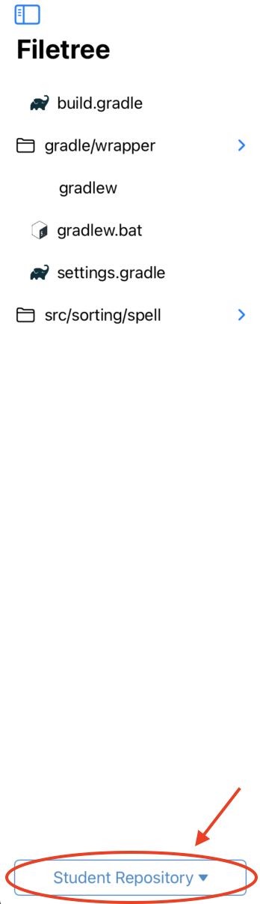

Programming Exercise
====================
.. raw:: html

	<iframe src="https://live.rbg.tum.de/w/artemisintro/40962?video_only=1&t=0" allowfullscreen="1" frameborder="0" width="600" height="500">
		Programming exercise assessment tutorial
	</iframe>

While assessing programming exercises, you can browse the student, solution, and template 
repositories using the file tree pane located on the left side of the screen:

	
	File Tree (Left Pane)

.. note:: You cannot add new referenced feedback or edit existing feedback while browsing the 
	solution and template repositories.

The content of the selected file is shown in the central pane. Green highlights 
indicate the changed and added lines as shown below:

.. figure:: ./images/code-editor.png
	:width: 60%
	:align: center
	
	Code View (Middle Pane)

When the referenced feedback mode (|feedback-mode-btn|) is enabled, you can drag 
your finger over the code to highlight the specific part you are referring to.

The correction pane can be dragged from the right to view the problem statement,
correction guidelines, and an overview of feedback added to the submission. All
three states of the correction pane can be seen below:

|pic1| |pic2| |pic3|

General feedback can be added with the |plus-btn| button. This button reveals a 
sheet where you can type the feedback text, adjust the score, and select a grading 
criterion:

.. figure:: ./images/add-feedback-sheet.png
	:width: 40%
	:align: center
	
	Add Feedback Sheet

You can edit feedback by tapping on the |edit-btn| button on the correction pane.

.. |pic1| image:: ./images/problem-statement.png
   :width: 30%

.. |pic2| image:: ./images/correction-guidelines.png
   :width: 30%
   
.. |pic3| image:: ./images/feedback.png
   :width: 30%

   

   
.. |feedback-mode-btn| image:: ./images/feedback-mode-btn.png
   :width: 25px