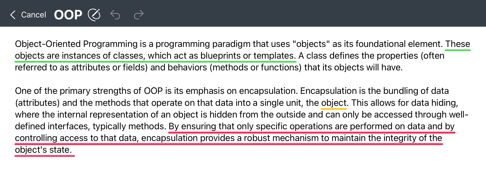
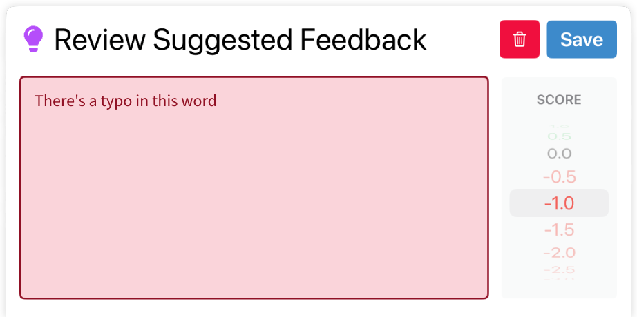
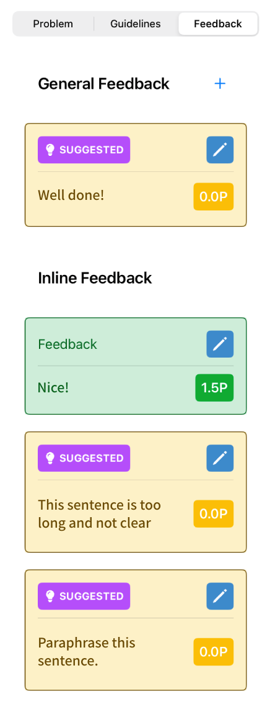

Text Exercise
=============
.. raw:: html

	<iframe src="https://live.rbg.tum.de/w/artemisintro/40925?video_only=1&t=0" allowfullscreen="1" frameborder="0" width="600" height="500">
		Text exercise assessment tutorial
	</iframe>
	
Similar to programming exercise assessments, when the referenced feedback mode (|feedback-mode-btn|) 
is enabled, you can drag your finger over the text to highlight the specific part you are referring to.

.. |feedback-mode-btn| image:: ../assessment-overview/images/feedback-mode-btn.png
   :width: 25px

Feedback Suggestions
--------------------
Themis shows feedback suggestions for text exercises when available. The suggestions are shown 
as colored underlines. 

	
	Feedback Suggestions on Text

You can tap on the underlines to edit or reject suggestions. By default, all 
suggestions are automatically applied.

	
	Suggestion Review Sheet

	
	Feedback Suggestions on the Correction Pane